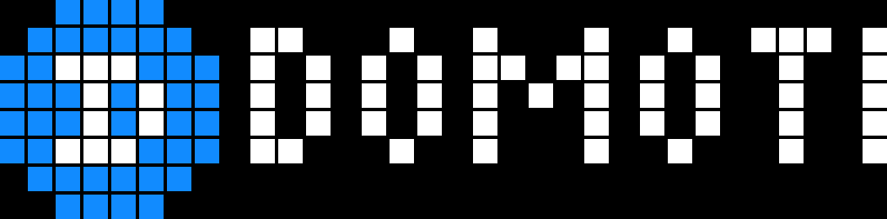
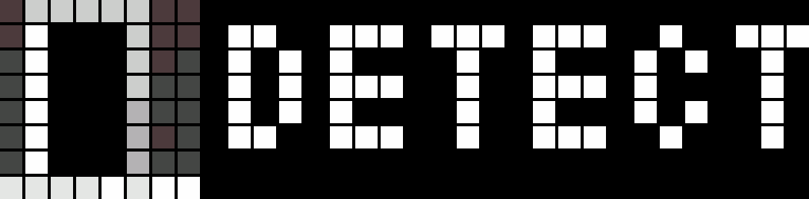
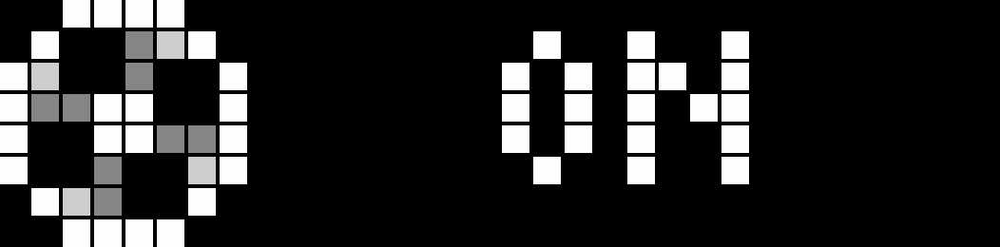
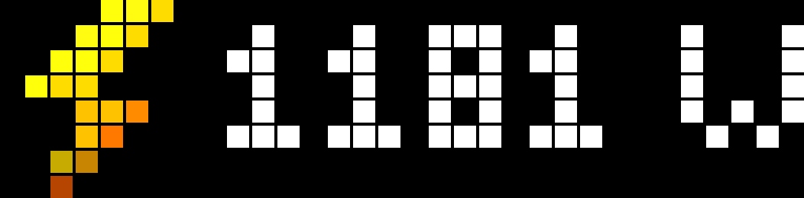
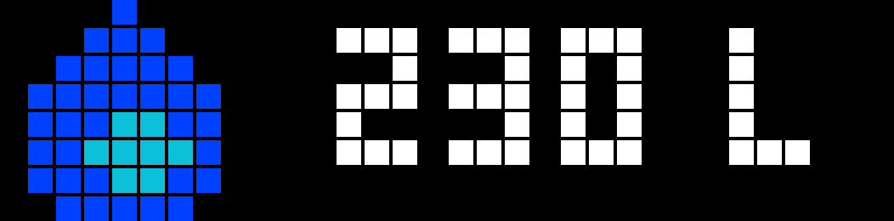

# Domoticz AWTRIX NG Plugin

**Domoticz Python plugin for the [AWTRIX NG](https://blueforcer.github.io/awtrix-ng/) smart pixel clock.**

[](https://github.com/galadril/Domoticz-AWTRIXNG-Plugin/actions/workflows/validate.yml)



Adds your AWTRIX NG panel to Domoticz as a set of virtual devices, so you can push notifications and custom apps from dzVents, Blockly or the Domoticz UI, control the display, and read the panel's sensors back into Domoticz.

> This plugin targets the **AWTRIX NG `/api/v1` HTTP API** and is not compatible with AWTRIX 3 firmware.

---

## Installation

1. Clone into your Domoticz `plugins` directory:

   ```bash
   cd domoticz/plugins
   git clone https://github.com/galadril/Domoticz-AWTRIXNG-Plugin
   ```

2. Install the one dependency:

   ```bash
   pip3 install requests
   ```

3. Restart Domoticz, then go to **Setup → Hardware** and add the **AWTRIX NG** hardware type.

### Parameters

| Parameter | Description |
| --- | --- |
| **IP Address** | Address of your AWTRIX NG panel. |
| **Username** / **Password** | Only needed if you enabled HTTP authentication on the panel. Leave blank otherwise. |
| **Default Icon ID** | Icon used when a notification or custom app is sent as plain text. Defaults to `39762`. |
| **Debug** | Domoticz debug level. Set to **All** to log every HTTP request and the panel's replies. |

---

## Devices

The plugin creates 22 devices. Sensors are polled every 30 seconds and panel settings every two minutes, so changes you make on the device itself — or over MQTT, or from a script — are reflected back into Domoticz.

### Sensors — read from the panel

| Device | Notes |
| --- | --- |
| **Lux** | Ambient light. AWTRIX NG reports this as a relative **0–100 %**, deliberately not absolute lux, because a bare LDR on an unknown divider has no absolute unit. Only present when the panel has a light sensor. |
| **Temp+Hum** | Temperature, humidity and a derived comfort index. Carries the battery level on battery-powered builds. Only present when the panel has an environment sensor. |

### Controls — two-way

| Device | Notes |
| --- | --- |
| **Power** | Turns the matrix on and off. |
| **Brightness** | Dimmer, 1–100 %. Switching it **Off** hands brightness control back to the light sensor (auto-brightness) rather than making the panel dark. |
| **Text color** | Global text colour. Switching it **Off** restores white. |
| **Transition effect** | Selector over all 22 transitions the panel can use between apps. |
| **Overlay** | Selector for the weather overlay drawn over the clock: Snow, Rain, Drizzle, Storm, Thunder, Frost. |
| **Auto Transition** | Switching this off freezes the rotation on the current app. |
| **Clock layout** | Selector over the seven built-in clock layouts. |
| **Text scroll** | Selector for how text that does not fit moves: Static, Wrap, Loop, Bounce. |
| **Moodlight** | Lights the whole matrix in one colour. Brightness follows the dimmer level; switching it off returns the panel to normal. |
| **Indicator Top** / **Middle** / **Bottom** | The three corner indicator LEDs, as colour switches. Handy for alerts that should stay visible whatever app is on screen. |

The **Transition effect** and **Overlay** selectors are validated against `GET /api/v1/capabilities` when the plugin starts, so an effect your firmware build does not ship is reported in the log instead of being silently rejected by the panel.

### Push buttons — fire an action

| Device | Notes |
| --- | --- |
| **Next App** / **Previous App** | Step through the app rotation. |
| **Dismiss Notification** | Instantly clears the notification currently on screen. |

### Push buttons — send a payload

These read their payload from the device's **description** and act when the button is switched on. See [Sending payloads](#sending-payloads).

| Device | Payload |
| --- | --- |
| **Send Notification** | A notification to show immediately. |
| **Send Custom App** | An app added to the rotation. |
| **Send Settings** | A JSON object of panel settings. |
| **RTTTL** | An RTTTL melody string. |
| **Sleep Mode** | A number of seconds to sleep. |

---

## Sending payloads

Set the **description**, then switch the button on. This is the pattern every sample script uses:

```lua
local appDevice = domoticz.devices('AWTRIXNG - Send Custom App')
appDevice.setDescription('{ "text": "21.4C", "icon": 2355 }')
appDevice.switchOn().afterSec(2)
```

> To let dzVents set descriptions you must allow `127.0.0.*` as a trusted network under **Setup → Settings → Security**.

`Send Notification` and `Send Custom App` accept three forms:

| Form | Example |
| --- | --- |
| **JSON object** | `{ "text": "600 L", "icon": 9766 }` |
| **JSON array** (multi-page) | `[{ "text": "600 L", "icon": 9766 }, { "text": "364 W", "icon": 95 }]` |
| **`icon;message`** | `9766;Check the temperature!` |
| **Plain message** | `Hello, AWTRIX!` — uses the *Default Icon ID* parameter |

All payload fields are documented under [Payload reference](https://blueforcer.github.io/awtrix-ng/reference/payload/), and there are worked examples in the [notifications](https://blueforcer.github.io/awtrix-ng/guides/notifications/) and [pushed apps](https://blueforcer.github.io/awtrix-ng/guides/pushed-apps/) guides.

### Naming your custom apps

Custom apps are pushed under the app name `Domoticz` by default, so a second script would overwrite the first one's app. Add an `appname` key to keep them separate:

```json
{ "appname": "Watermeter", "text": "600 L", "icon": 9766 }
```

An array payload creates indexed apps — `Domoticz0`, `Domoticz1`, … — which is how the multi-page sample rotates several device states through one app slot.

### Settings

`Send Settings` takes a JSON object of [settings](https://blueforcer.github.io/awtrix-ng/reference/settings/) keys:

| Example | JSON |
| --- | --- |
| Show every app for 10 s with a 2 s transition | `{ "appDurationMs": 10000, "transitionDurationMs": 2000 }` |
| Show the weekday bar in green | `{ "weekdayBar": true, "calendarHeaderColor": "#00FF00" }` |
| Use Fahrenheit and a 12-hour clock | `{ "useCelsius": false, "time24h": false }` |
| Fixed brightness at half power | `{ "autoBrightness": false, "brightness": 128 }` |

Colours accept `"#RRGGBB"`, `"RRGGBB"`, `[r, g, b]` or `["HSV", h, s, v]`. All durations are integer **milliseconds** and end in `Ms`.

### Sleep Mode

Put the seconds to sleep in the description (or set the device text) and switch it on:

```lua
local sleepDevice = domoticz.devices('AWTRIX NG - Sleep Mode')
sleepDevice.setDescription('1800')
sleepDevice.switchOn()
```

---

## Icons

Icons must be uploaded to the panel itself; the plugin only references them by ID. Grab 8×8 icons from the [LaMetric developer site](https://developer.lametric.com/icons), or use the bundled pack in [`icons/`](icons).

The default Domoticz icon is **39762**. See the [icons guide](https://blueforcer.github.io/awtrix-ng/guides/icons/) for how to upload them, and the [icon editor](https://blueforcer.github.io/awtrix-ng/guides/icon-editor/) for drawing your own. Icon IDs and files carry over unchanged from AWTRIX 3.

An icon ID is the file name without its extension, so `2355.jpg` on the panel is `"icon": "2355"`. AWTRIX NG expects that as a **string** and *ignores* a numeric `icon` without raising an error, which shows up as text rendering correctly with the icon column missing. Because dzVents serialises Lua numbers as JSON numbers, the plugin converts a numeric `icon` for you — `{"icon": 2355}` and `{"icon": "2355"}` both work.

---

## Samples

Ready-to-use dzVents scripts live in [`samples/`](samples):

| Script | What it does |
| --- | --- |
| [`dzvents-sample.txt`](samples/dzvents-sample.txt) | Pushes a rotating set of Domoticz device states with icons |
| [`dzvents-weather-overlay-sample.txt`](samples/dzvents-weather-overlay-sample.txt) | Sets the weather overlay from a forecast device |
| [`dzvents-sleep-motion-sample.txt`](samples/dzvents-sleep-motion-sample.txt) | Sleeps the panel after a period of no motion |
| [`dzvents-next-app-sample.txt`](samples/dzvents-next-app-sample.txt) | Advances the app rotation on a timer |
| [`dzvents-draw-animation-sample.txt`](samples/dzvents-draw-animation-sample.txt) | Sends drawing commands for a custom animation |

There are also community flows for Domoticz on the [AWTRIX Flows site](https://flows.blueforcer.de/search?provider=domoticz).






---

## Troubleshooting

| Symptom | Check |
| --- | --- |
| Nothing happens when a push button fires | The payload goes in the device **description**, not its name or text. dzVents also needs `127.0.0.*` trusted under Setup → Settings → Security. |
| `422 validationFailed` in the log | Your payload carries a key NG does not know, and the response names the offending `field`. NG rejects the whole payload rather than ignoring the key, so nothing is stored. |
| `400 invalidName` | An `appname` outside `A–Z a–z 0–9 _ -` or longer than 32 characters. The plugin strips invalid characters and logs what it used. |
| No Lux or Temp+Hum readings | The panel only reports these when the matching sensor is fitted. The devices stay at their last value. |
| Transition or overlay logged as unsupported | Your firmware build's `GET /api/v1/capabilities` does not list it. |
| Text appears but the icon does not | The icon is not on the panel. Check `GET /api/v1/files?dir=/ICONS` — a missing icon falls back to the icon-less layout silently. |
| `AWTRIX NG is unreachable` then long silence | Expected. The plugin backs off exponentially to about eight minutes between retries so a powered-down panel does not stall Domoticz, and logs again once it reconnects. |

## Development

`plugin.py` cannot be imported outside Domoticz, so the tests stub `Domoticz` and `requests` and drive the plugin against a fake panel that returns the real AWTRIX NG status codes:

```bash
python tests/test_plugin.py
python .github/scripts/validate_plugin.py
ruff check .
```

The tests pin the things that break automations silently: unit numbers, device names and types, selector level values, and the exact JSON sent to each endpoint. If you change any of those, expect a failure — and check whether an existing automation would have broken too.

---

## Links

- [AWTRIX NG documentation](https://blueforcer.github.io/awtrix-ng/) · [HTTP API reference](https://blueforcer.github.io/awtrix-ng/reference/http/) · [OpenAPI spec](https://blueforcer.github.io/awtrix-ng/api/openapi.yaml)
- [AWTRIX NG firmware](https://github.com/Blueforcer/awtrix-ng)
- [Domoticz plugin documentation](https://www.domoticz.com/wiki/Plugins)
- Building your own Domoticz plugin? Start from the [plugin template](https://github.com/galadril/Domoticz-Python-Plugin-Template).

## Change log

| Version | Information |
| --- | --- |
| 1.0.0 | Initial release for AWTRIX NG |

## Contributing

Issues and pull requests are welcome at [galadril/Domoticz-AWTRIXNG-Plugin](https://github.com/galadril/Domoticz-AWTRIXNG-Plugin).

## Donation

If you would like to say thanks, you could always buy me a cup of coffee (/beer)!

[](https://www.paypal.me/markheinis)

## License

[MIT](LICENSE.txt)
